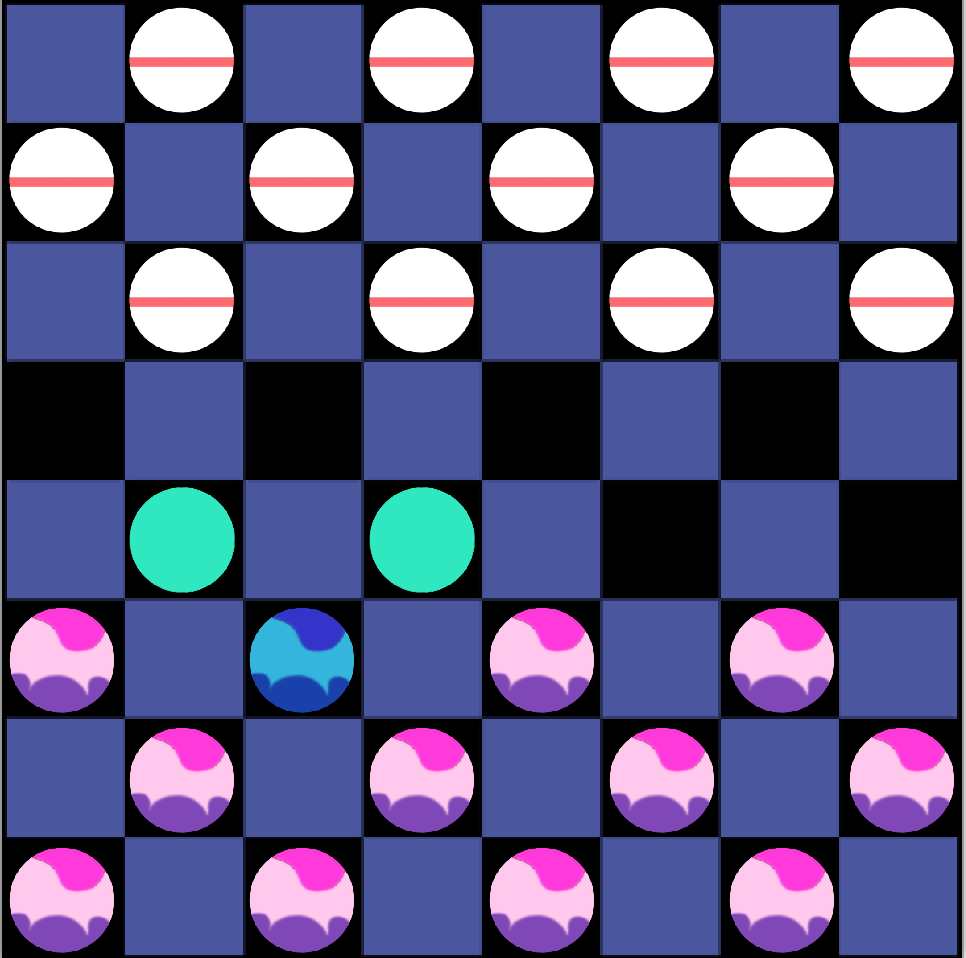

# DSA-Mini-Project
A project by group 38, with the topic of '8x8 checkers' for DSA mini project submission

# Prerequisites

## Minimum Computer Specifications
Graphics - Intel HD 620<br />
RAM - 8 BG<br />
Processor - Intel i7 7500U

## Recommended Computer Specifications
Graphics - RTX 3090 <br />
RAM - 32 GB<br />
Processor - AMD Ryzen 9 5900X

## Installing SDL library
To install in Ubuntu/Linux, open Terminal and run the following commands:
```
sudo apt-get update
sudo apt-get install libsdl2-2.0-0 libsdl2-dbg libsdl2-dev libsdl2-image-2.0-0 libsdl2-image-dbg libsdl-image-dev
```
# Running the game
To run the game, you need to run the `Makefile` that is included in the repository.<br />
Open the folder containing the `Makefile` ( `SDL Coding` ) and the source code functions in the Terminal, and type the following command in:
```
make
```
This will create an executable named `game` which can then be run.

# Rules of the game
To refer to the rules of the game, click the link below:
https://en.wikipedia.org/wiki/English_draughts#Rules

If you're too lazy to open the link, the rules are given below:
- The opponent with the darker pieces moves first.

- Pieces may only move one diagonal space forward (towards their opponents pieces) in the
  beginning of the game.

- Pieces must stay on the dark squares.

- To capture an opposing piece,"jump" over it by moving two diagonal spaces in the direction of
  the the opposing piece.

- A piece may jump forward over an opponent's pieces in multiple parts of the board to capture
  them.

- Keep in mind, the space on the other side of your opponent’s piece must be empty for you to
  capture it.

- If your piece reaches the last row on your opponent's side, you may "crown" the piece that made it to the Kings Row. Thereby making it a "King Piece."

- A piece can't do a double jump immediately after becoming a king

- King pieces may still only move one space at a time during a non-capturing move. However,
  when capturing an opponent's piece(s) it may move diagonally forward or backwards.

## The game is won when all of your opponent's pieces are captured !!


# Interface

At the beginning, there is a screen that allows both players to choose their desired pieces through the terminal.


Then the game board is displayed. 


From here there are 5 possible modes to progress to:

1. Move selection - The player can click on their pieces and move their piece based on the possible moves. The possible moves are shown on screen



  To unselect a piece, click it again

2. Undo Move - Press `u` on the keyboard to return to the previous state of the game

3. Review Mode - Press `r` on the keyboard to go into review mode and view all the moves made through the game. The state can be changed using the right and left arrow keys or the `h` and `l` keys on the keyboard(for the vim fans). To exit review mode, press `x` on the keyboard.

4. Next K Moves - Press `k` on the keyboard to go into Next K Moves mode. In the Terminal, there will then be a prompt asking for the value of k. Then, similar to Review mode, the final state of the board after K moves will then be viewable. Exit is also done using `x`.

5. Draw Mode - If the player presses `d` on the keyboard, the game then enters draw mode and the game ends with a draw. The screen closes after 10 seconds.

6. Forfeit - If the player whose turn it is presses `f` on the keyboard, the game recognises that the player wants to forfeit, and game ends with the other player winning. The screen closes after 10 seconds.
